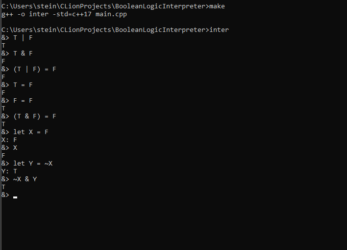

Boolean Logic Intepreter
========================

The program is a simple console program that interprets the basic
boolean operations, `AND`, `OR` and `NOT`.
It also supports variable declaration using the `let` keyword.

### Syntax
1. AND is represented by `&`
2. OR is represented by `|`
3. NOT is represented by `~`
4. EQUAL/ASSIGNMENT is represented by `=`

Input empty line to exit

### Requirements
1. C++ Compiler, GCC/GNU prefered.
2. Terminal or Command prompt for windows.
3. GNU Make or CMAKE (optional)

### Building and Running
Two ways of building the program. Using make or directly compiling with g++.
___(in both cases `g++` must be present.)___

#### Using Makefile
1. Open console and `cd` to the root folder of the program. Run
```console
make
```

This should run without error and an executable called __inter__ should 
be generated.

2. Run the program
If on windows run
```console
inter  
```

On unix (linux) based systems
```console
./inter
```

#### Using G++

1. Open console and `cd` to the root folder of the program. Run
```console
g++ -o inter -std=c++17 main.cpp
```

2. Run the program
   If on windows run
```console
inter  
```

On unix (linux) based systems
```console
./inter
```

### Example Running



### References

- [Write-a-C-interpreter repository](https://github.com/lotabout/write-a-C-interpreter)
- [Let's build a compiler, by jack crenshaw](https://compilers.iecc.com/crenshaw/)
- [How to approach writing an interpreter from scratch](https://www.toptal.com/scala/writing-an-interpreter)
- [c++ std stl references](https://cplusplus.com/reference/)